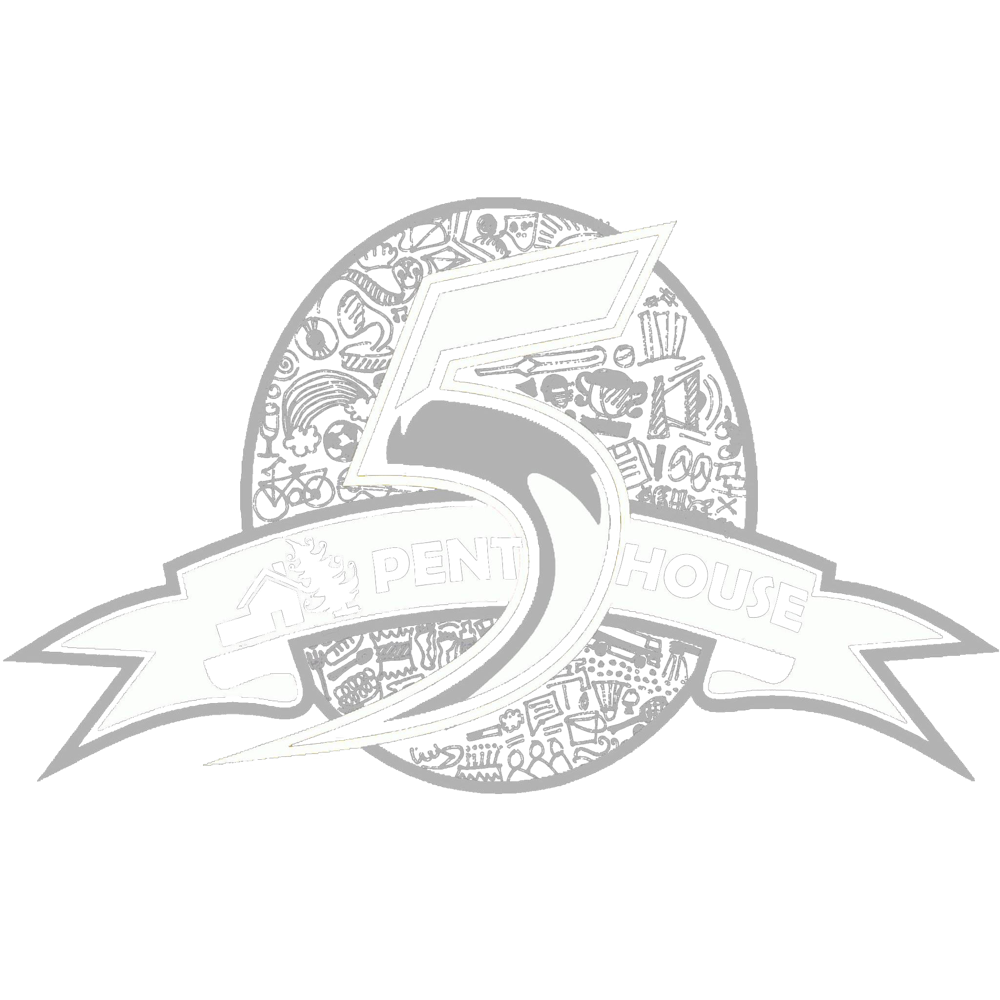

<div align="center">
  


[H5 Website] | [Hosting] | [Getting Started]
</div>

This is the main source code repository for [H5 Website]. It contains both the Next.js frontend application and FastAPI backend server code.

[H5 Website]: https://h5-nextjs-frontend.vercel.app/
[Getting Started]: #quick-start
[Hosting]: #hosting

## Features and tech stack?

- **Modern Stack:** Built with Next.js 14 and FastAPI, offering server-side rendering and efficient API handling
- **AI Assistant:** Integrated Gemini AI for intelligent hostel-related queries
- **Interactive UI:** Framer Motion animations, responsive design, and dark mode support
- **Vector Search:** ChromaDB for efficient information retrieval


## Code Overview

This section explains a brief code overview of main pages and components

### Pages

- **Home Page** (`app/home/page.tsx`): The main landing page introducing Hostel 5, featuring sections for about, activities, and more.
- **Technicals Page** (`app/technicals/page.tsx`): Highlights technical activities and events hosted by the hostel.
- **Sports Page** (`app/sports/page.tsx`): Showcases sports events and activities, encouraging participation and support.
- **Culturals Page** (`app/culturals/page.tsx`): Dedicated to cultural events, showcasing the vibrant cultural life at Hostel 5.
- **FAQs Page** (`app/faqs/page.tsx`): Provides answers to frequently asked questions, helping users find information quickly.
- **Contact Page** (`app/contact/page.tsx`): Contains contact information and a team section, allowing users to reach out for more details.
- **Mess Menu Page** (`app/messmenu/page.tsx`): Displays the meal timings and menu options available at the hostel mess.

### Components

- **MainLayout** (`app/components/MainLayout.tsx`): The primary layout component that wraps around all pages, including navigation and footer.
- **CardsSection** (`app/components/CardsSection.tsx`): Displays a series of cards highlighting different aspects of hostel life, such as sports, culturals, and technicals.
- **Navigation** (`app/components/Navigation.tsx`): Manages the top navigation bar across the site.
- **H5ChatDialog** and **H5ChatButton**: Components for the chat interface, allowing users to interact with the AI assistant.
- **EventCard** (`app/components/EventCard.tsx`): Used to display individual events with images and descriptions.
- **LoadingScene** (`app/components/LoadingScene.tsx`): Manages the loading animations and transitions between sections.

### Styles

- **Global Styles** (`app/styles/globals.css`): Contains global CSS variables and base styles applied throughout the application.
- **Page-specific Styles**: Each page and component has its own CSS file, such as `home.css`, `cards.css`, `layout.css`, and more, ensuring modular and maintainable styling.


### Analytics

- Integrated with Vercel Analytics to track user interactions and page views, providing insights into user behavior.


## Quick Start

1. Clone the repository
2. Follow the [Installation Guide](#installation)
3. Start developing with `npm run dev` for frontend and `uvicorn main:app --reload` for backend

### Prerequisites
- Node.js (v18+)
- Python (v3.8+)
- Gemini API key

## Installation
### Frontend Setup

1. **Clone & Navigate**
   ```bash
   git clone https://github.com/sreehariX/h5-nextjs-frontend.git
   cd h5-nextjs-frontend
   ```

2. **Install Dependencies**
   ```bash
   npm install
   ```

3. **Start Development Server**
   ```bash
   npm run dev
   ```

4. **Access the Application**
   - Open your browser and visit: `http://localhost:3000`
  

### Backend Setup

1. **Navigate to Backend Directory**
   ```bash
   cd h5website-backend
   ```

2. **Create & Activate Virtual Environment**
   ```bash
   # Windows
   python -m venv venv
   .\venv\Scripts\activate

   # macOS/Linux
   python3 -m venv venv
   source venv/bin/activate
   ```

3. **Install Dependencies**
   ```bash
   pip install -r requirements.txt
   ```

4. **Configure Environment Variables**
   Create a `.env` file in the backend root directory:
   ```env
   GEMINI_API_KEY=your_gemini_api_key
   ```

5. **Start Development Server**
   ```bash
   uvicorn main:app --reload
   ```

6. **Verify Installation**
   - API will be running at: `http://localhost:8000`


## Features

- **AI Chat Assistant**: Get instant answers about hostel facilities, rules, and events
- **Interactive UI**: Smooth animations and responsive design
- **Vector Search**: Efficient information retrieval using ChromaDB
- **Markdown Support**: Rich text formatting for announcements and FAQs

## AI chatbot implementation
- We have a ContentForRag.csv file which contains content about hostel then we vectorize them using gemini embeddings model
- Then do a cosine similarity between the user and and the vectors we have 
- We pick the to 3 vectors and pass that vectors content to gemini flash model to get a summarized response 
- The content is breaked into chunks if it is above 2000 tokens because gemini embeddings model only accepts approx 2000 tokens
- We get the most accuracy by doing this Retrieval-Augmented Generation (RAG) appraoch 

## Tech Stack

- **Frontend**: Next.js 14, Framer Motion, TailwindCSS
- **Backend**: FastAPI, ChromaDB, Gemini AI
- **Styling**: CSS Modules, TailwindCSS
- **Animations**: Framer Motion
- **AI**: Google Gemini API

## Hosting 

### frontend
- Frontend is currently hosted on vercel we will shift to gymkhana ones their servers are ready


### backend
- For chatbot we are using chromadb,gemini api and fastapi
- The fastapi is running on a azure vm we deployed it .
- It is configured using apache server


## License

MIT LICENSE
